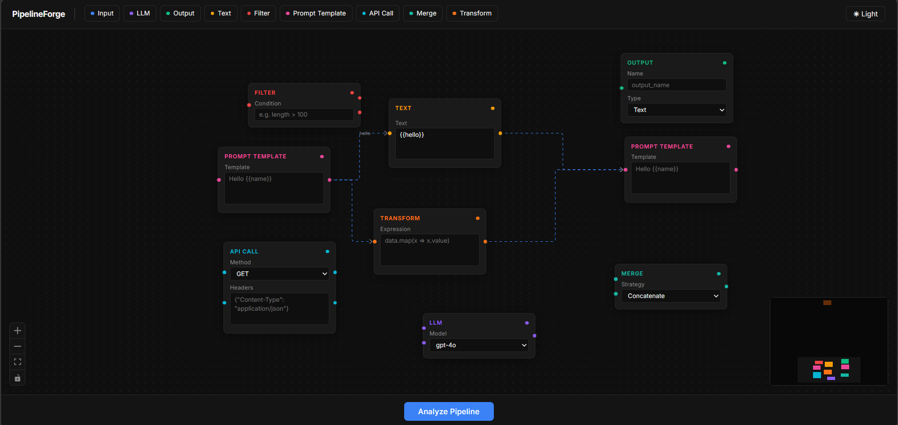
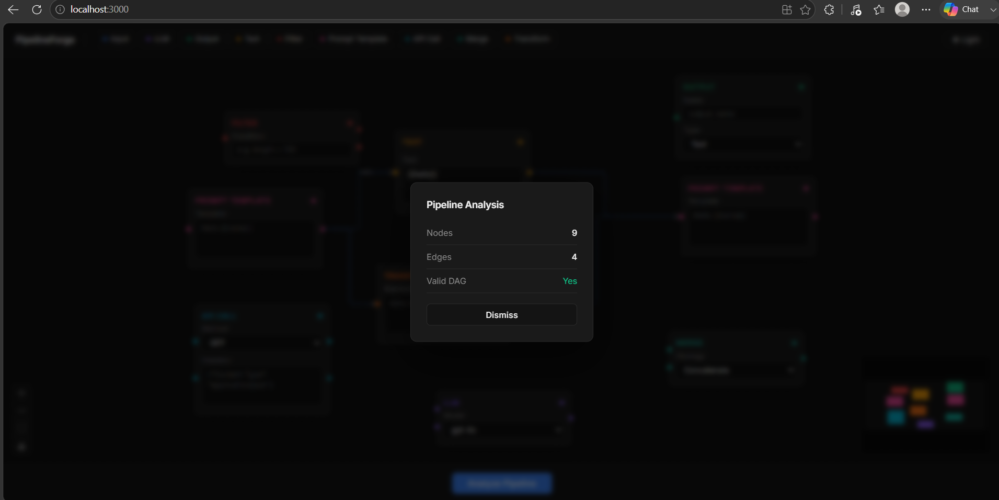

# PipelineForge

**Visual AI Pipeline Builder — VectorShift Technical Assessment**


Built by Shhaurya Jaiswal (Thebinary110)



---

## Overview

PipelineForge is a node-based visual pipeline editor inspired by LangFlow and n8n, built as a VectorShift frontend technical assessment. It provides a drag-and-drop canvas where users compose AI workflows by connecting 9 configurable node types — including LLM, API Call, Prompt Template, and Transform nodes. A FastAPI backend validates the constructed graph in real time, running a DFS-based DAG check and returning node count, edge count, and cycle detection results through a custom analysis modal.


---

## Assessment Coverage

| Part | Feature | Status |
|------|---------|--------|
| 1 | Node Abstraction — BaseNode + declarative nodeConfig registry | ✅ Complete |
| 2 | Styling — dark theme, per-node accent colors, minimalist design | ✅ Complete |
| 3 | Text Node — dynamic `{{variable}}` handles + textarea auto-resize | ✅ Complete |
| 4 | Backend Integration — DAG validation + pipeline analysis modal | ✅ Complete |

---

## Architecture

### BaseNode Abstraction

All nine node types delegate their rendering to a single `BaseNode` component. `BaseNode` accepts a configuration object — title, accent color, handle definitions, and field schemas — and produces the full node card including handles, header, and form fields. Individual node files contain no logic; they exist solely to spread a config entry from `nodeConfig.js` onto `BaseNode` and register the result with ReactFlow. Adding a new node type requires zero changes to `BaseNode` or any infrastructure file.

### Data-Driven Node Registry

`nodeConfig.js` is a pure data module — no React, no JSX, no imports. Every node type is described as a static configuration object keyed by its ReactFlow type string. This enforces a clean separation: config changes are isolated to one file, rendering logic lives exclusively in `BaseNode`, and the open/closed principle holds — the system is open for extension (new config entry) but closed for modification (no existing code changes).

The design applies single responsibility throughout: `nodeConfig.js` owns data, `BaseNode.js` owns rendering, `store.js` owns state, and each node file owns only its ReactFlow registration.

### File Tree

```
src/
├── nodes/
│   ├── BaseNode.js        # Core rendering abstraction
│   ├── nodeConfig.js      # Declarative node type registry
│   ├── inputNode.js       # + 8 other node files (3 lines each)
│   └── ...
├── store.js               # Zustand global state
├── ui.js                  # ReactFlow canvas
├── toolbar.js             # Draggable node palette
├── submit.js              # Pipeline submission + result modal
└── App.js                 # Root layout
```

---

## Node Types

| Node | Inputs | Outputs | Fields |
|------|--------|---------|--------|
| Input | — | `value` | `name` (text), `type` (Text / File) |
| Output | `value` | — | `name` (text), `type` (Text / Image) |
| LLM | `system`, `prompt` | `response` | `model` (gpt-4o / gpt-4 / gpt-3.5-turbo / claude-3-5-sonnet) |
| Text | — | `output` | `text` (textarea, supports `{{variables}}`) |
| Filter | `data` | `passed`, `failed` | `condition` (text) |
| Prompt Template | `variable` | `prompt` | `template` (textarea) |
| API Call | `url`, `body` | `response`, `error` | `method` (GET / POST / PUT / DELETE), `headers` (textarea) |
| Merge | `input1`, `input2` | `merged` | `strategy` (Concatenate / JSON Merge / Array Push) |
| Transform | `data` | `result` | `expression` (textarea) |

---

## Key Features

### BaseNode Abstraction

Every node reduces to a three-line file — one import for `BaseNode`, one import for `NODE_CONFIGS`, and one JSX return:

```js
// filterNode.js
import { BaseNode } from './BaseNode';
import { NODE_CONFIGS } from './nodeConfig';

export const FilterNode = ({ id, data }) => (
  <BaseNode id={id} data={data} {...NODE_CONFIGS.filter} />
);
```

To add a new node type:

1. Add a configuration entry to `nodeConfig.js` (title, accentColor, inputs, outputs, fields).
2. Create a three-line node file following the pattern above.
3. Register the component in `ui.js` `nodeTypes` and add a chip to `toolbar.js`.

No changes to `BaseNode.js` or any other file are required.

### Dynamic Variable Detection (Text Node)

The Text node passes `dynamicInputs={[]}` to `BaseNode`, which signals dynamic mode. On every keystroke in the textarea, `BaseNode` runs:

```js
const VARIABLE_REGEX = /\{\{(\w+)\}\}/g;
```

All unique variable names captured in group 1 are deduplicated with a `Set` and stored in local state as `detectedVars`. `BaseNode` renders one ReactFlow `Handle` per detected variable on the left side of the node, labeled with the variable name and positioned using the evenly-spaced formula `((index + 1) / (total + 1)) * 100%`.

The textarea auto-resizes on each change by setting `height: 'auto'` then `height: scrollHeight + 'px'`. Node width expands proportionally to the longest line (`charCount * 7px`), clamped between 220 px and 480 px.


### DAG Validation

The backend runs a 3-color DFS on the submitted graph:

- `0` — unvisited
- `1` — currently in the DFS call stack
- `2` — fully processed

A back edge (neighbor with color `1`) indicates a cycle. The algorithm iterates all node IDs to handle disconnected components. The endpoint returns:

```python
{ "num_nodes": int, "num_edges": int, "is_dag": bool }
```

The frontend displays results in a dark card modal with backdrop blur — no `window.alert`.



---

## Getting Started

### Frontend

```bash
cd frontend
npm install
npm start
```

Runs on `http://localhost:3000`.

### Backend

```bash
cd backend
pip install fastapi uvicorn
uvicorn main:app --reload
```

Runs on `http://localhost:8000`. CORS is open to all origins for local development.

---

## Tech Stack

| Layer | Technologies |
|-------|-------------|
| Frontend | React 18, ReactFlow 11, Zustand 5, Inter (Google Fonts) |
| Backend | Python 3.9+, FastAPI, Pydantic v2 |
| Tooling | Create React App, Uvicorn |
